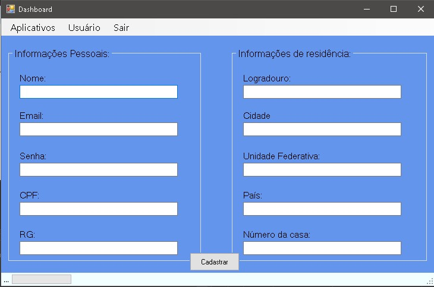
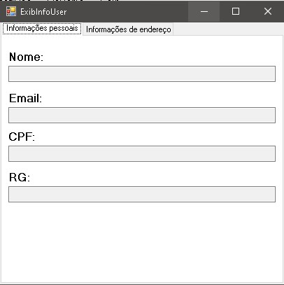
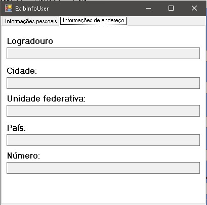
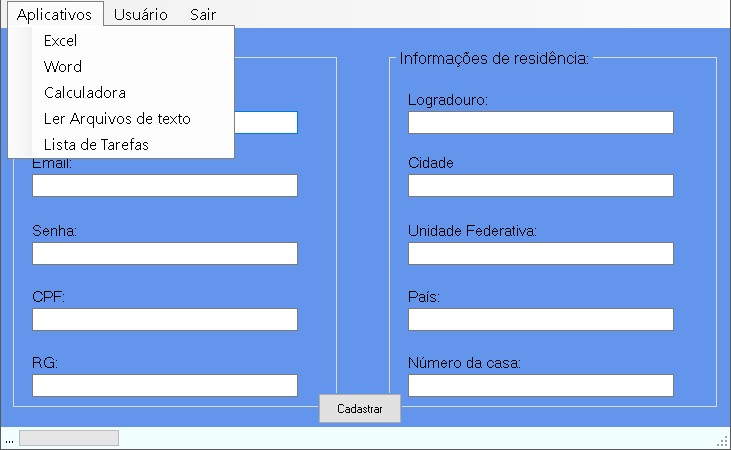

# Dashboard de funcionário
Dashboard de um funcionário
<ul>
  <li>Opções de cadastro</li>
  <li>Abrir ferramentas office</li>
  <li>Listar tarefas</li>
</ul>
# Telas do programa
<h3>Tela de cadastro</h3>

<h3>Tela de informações de usuário</h3>

<h3>Tela de informações de endereço do usuário</h3>

<h3>Tela de menu de aplicativos</h3>

